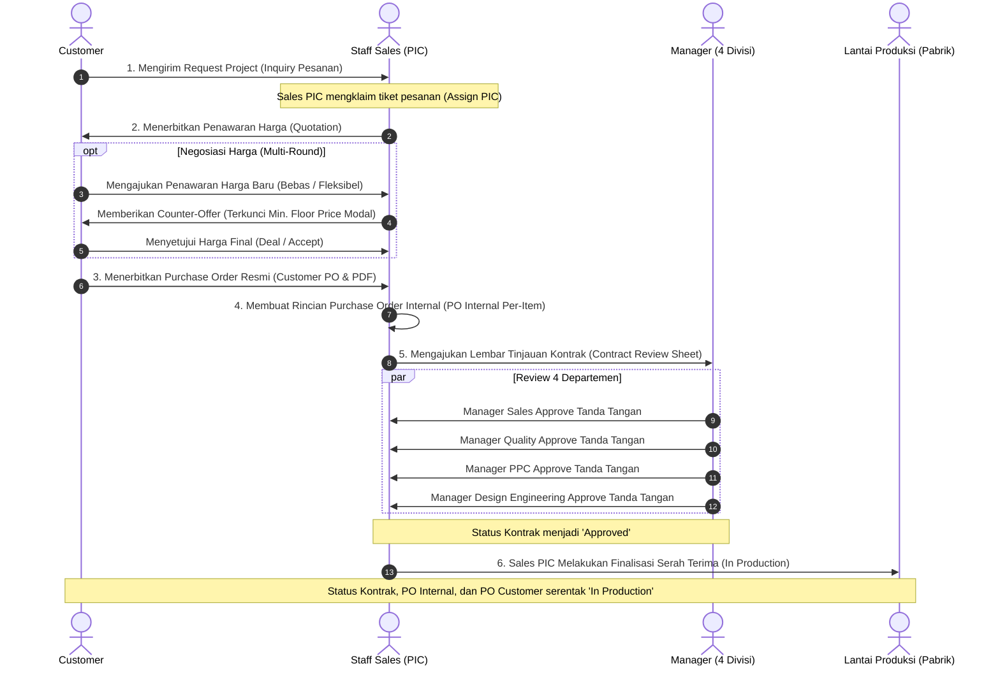

# PENGEMBANGAN APLIKASI SISTEM INFORMASI PELACAKAN STATUS PESANAN PELANGGAN PADA DIVISI PURCHASING SALES MARKETING DI PT. METINCA PRIMA INDUSTRIAL WORKS JAKARTA

Aplikasi berbasis web enterprise untuk mendigitalisasi, mengotomatisasi, serta melacak status pesanan pelanggan (*Order Tracking System*) secara *end-to-end* pada divisi **Purchasing Sales Marketing** PT. Metinca Prima Industrial Works Jakarta. 

Sistem ini memfasilitasi integrasi rantai transaksi mulai dari penerimaan permintaan proyek (*Request Project*), pembuatan dan negosiasi penawaran harga (*Quotation & Multi-Round Negotiation*), penerbitan *Purchase Order* (PO Pelanggan & PO Internal), lembar peninjauan kontrak lintas divisi (*Contract Review Sheet* melibatkan 4 Divisi Manajerial), amandemen pesanan, hingga serah terima finalisasi ke lini produksi (*In Production*).

---

## Daftar Isi
1. [Latar Belakang & Tujuan Sistem](#1-latar-belakang--tujuan-sistem)
2. [Teknologi yang Digunakan (Tech Stack)](#2-teknologi-yang-digunakan-tech-stack)
3. [Hak Akses & Struktur Pengguna (User Roles)](#3-hak-akses--struktur-pengguna-user-roles)
4. [Alur Kerja Transaksi Utama (End-to-End Workflow)](#4-alur-kerja-transaksi-utama-end-to-end-workflow)
5. [Fitur Utama & Logika Bisnis (Business Rules)](#5-fitur-utama--logika-bisnis-business-rules)
6. [Struktur Database & Relasi Model](#6-struktur-database--relasi-model)
7. [Petunjuk Instalasi & Menjalankan Aplikasi](#7-petunjuk-instalasi--menjalankan-aplikasi)
8. [Akun Demo Pengujian (Demo Accounts)](#8-akun-demo-pengujian-demo-accounts)
9. [Pengujian Otomatis (Automated Testing Suite)](#9-pengujian-otomatis-automated-testing-suite)

---

## 1. Latar Belakang & Tujuan Sistem

PT. Metinca Prima Industrial Works adalah perusahaan manufaktur pengecoran logam (*foundry*) dan permesinan presisi (*machining*). Dalam aktivitas bisnisnya, koordinasi antara pelanggan (*buyer*), tim penjualan (*sales*), dan departemen operasional pabrik memerlukan transparansi status pesanan, akurasi spesifikasi teknis, serta validitas komitmen harga dan jadwal pengiriman.

### Tujuan Utama Pengembangan Aplikasi:
- **Transparansi Status Real-Time**: Memberikan kemampuan pelacakan status pesanan secara mandiri (*self-service tracking*) bagi pelanggan dan internal perusahaan.
- **Akuntabilitas Sales PIC**: Menerapkan mekanisme kepemilikan tiket pesanan (*sales assignment & portfolio scoping*) sehingga setiap pesanan ditangani secara eksklusif oleh Sales PIC penanggung jawab.
- **Proteksi Profitabilitas & Modal**: Mencegah penjualan di bawah harga dasar modal (*floor price*) yang mencakup modal bahan baku dan modal proses kerja permesinan.
- **Kolaborasi Lintas 4 Divisi Manajerial**: Memastikan kelayakan produksi sebelum pesanan diproduksi melalui lembar tinjauan kontrak (*Contract Review Sheet*) dengan persetujuan tanda tangan digital dari Manager Sales, Quality/QC, PPC, dan Design Engineering.
- **Standarisasi Batas SOP**: Menetapkan batasan ruang lingkup kerja Purchasing Sales Marketing yang tuntas pada status **`In Production`** (saat seluruh klausul telah disetujui dan diserahterimakan ke lantai produksi pabrik).

---

## 2. Teknologi yang Digunakan (Tech Stack)

- **Backend Framework**: [Laravel 11.x](https://laravel.com/) (PHP 8.2+ / PHP 8.5)
- **Database Engine**: MySQL / MariaDB (Database: `metinca_db2`)
- **Frontend Architecture**: Blade Templating Engine, Vanilla CSS Custom Styling, Bootstrap 5 UI Components, & Tailwind Utility Classes
- **Digital Signature**: HTML5 Canvas / Signature Pad untuk Tanda Tangan Digital Manajerial
- **Document Rendering**: Barryvdh DomPDF (Ekspor PDF Penawaran Harga & Lembar Tinjauan Kontrak)
- **Spreadsheet Engine**: Maatwebsite Laravel Excel (Ekspor Laporan Transaksi ke XLSX)
- **Automated Testing**: PHPUnit Test Suite dengan SQLite In-Memory Database

---

## 3. Hak Akses & Struktur Pengguna (User Roles)

Sistem menerapkan pembagian hak akses (*Role-Based Access Control*) yang ketat berdasarkan peran dan divisi:

```
                                  ┌──────────────────────────┐
                                  │       Super Admin        │
                                  └─────────────┬────────────┘
                                                │
                 ┌──────────────────────────────┼──────────────────────────────┐
                 ▼                              ▼                              ▼
    ┌──────────────────────────┐  ┌──────────────────────────┐  ┌──────────────────────────┐
    │      Manager Sales       │  │    Staff Sales (PIC)     │  │   Customer (Pelanggan)   │
    └────────────┬─────────────┘  └─────────────┬────────────┘  └──────────────┬───────────┘
                 │                              │                              │
                 ▼                              │                              ▼
┌─────────────────────────────────┐             │                ┌───────────────────────────┐
│ Manager Divisi Lain:            │             │                │ Portal Tracking & Nego    │
│ - Manager Quality (QC)          │             │                └───────────────────────────┘
│ - Manager PPC (PPIC)            │             │
│ - Manager Design Eng. (DE)      │             │
└────────────────┬────────────────┘             │
                 │                              │
                 ▼                              ▼
    ┌────────────────────────────────────────────────────────┐
    │    Contract Review Sheet Approval & Finalisasi Produksi │
    └────────────────────────────────────────────────────────┘
```

| Role | Divisi | Tanggung Jawab & Hak Akses |
|---|---|---|
| **Super Admin** | *All* | Akses penuh (*super-privilege*) ke seluruh menu, manajemen pengguna, konfigurasi batas sistem, dan bypass manajerial. |
| **Manager** | `sales` | Supervisi portofolio seluruh staf sales, approval/penolakan harga khusus negosiasi, override kuota batas tawar, dan tanda tangan digital kontrak divisi sales. |
| **Manager** | `quality` | Peninjauan aspek mutu produk, toleransi ukuran, visual check, persyaratan sertifikat uji material, dan approval/penolakan klausul Quality. |
| **Manager** | `ppc` | Peninjauan kapasitas lini produksi, ketersediaan bahan baku, estimasi lead time pengiriman, dan approval/penolakan klausul PPC. |
| **Manager** | `design engineering` | Peninjauan gambar teknik (*drawing 2D/3D*), toleransi permesinan, komposisi bahan logam (FC/FCD), dan approval/penolakan klausul DE. |
| **Staff** | `sales` | Mengambil tiket request (*claim assignment*), membuat & mengirim *Quotation*, merespons negosiasi harga, menginput PO Internal, mengelola lembar kontrak, hingga finalisasi pesanan ke tahap produksi. |
| **Customer** | *Pelanggan* | Mengajukan *Request Project*, melihat & menawar penawaran harga (*Negotiate*), menerbitkan PO, mengajukan amandemen pesanan, serta melacak status pesanan secara publik/internal. |

---

## 4. Alur Kerja Transaksi Utama (End-to-End Workflow)



---

## 5. Fitur Utama & Logika Bisnis (Business Rules)

### A. Otorisasi Sales PIC & Scoping Portofolio
- **Tiket Mandiri**: Tiket inquiry yang masuk berstatus *unassigned*. Staf sales pertama yang mengambil tiket akan menjadi **Sales PIC**.
- **Perlindungan Tiket**: Staf sales lain dilarang memanipulasi, mengedit, menghapus, atau membuat penawaran dari tiket milik sales lain.
- **Portofolio Terisolasi**: Pada menu *Quotation*, *Purchase Order*, dan *PO Internal*, staf sales hanya disajikan daftar transaksi yang ditugaskan kepada dirinya.

### B. Master Artikel, Price List, & Floor Price
- Setiap produk memiliki master harga resmi (*Price List*) dan **Harga Dasar Modal (*Floor Price / Modal Bahan + Modal Proses*)**.
- **Customer Bebas Menawar**: Pelanggan memiliki fleksibilitas penuh untuk mengajukan harga negosiasi berapa pun tanpa pesan eror validasi sistem.
- **Proteksi Tim Sales**: Sistem menerapkan *hard-block* otomatis yang mencegah staf sales mengirimkan harga tawaran balik atau menyepakati harga di bawah harga modal bahan & proses.

### C. Sistem Negosiasi Multi-Round & Batas Kuota
- **Mekanisme Turn-Based**: Negosiasi dilakukan secara bergantian (Pelanggan $\rightarrow$ Sales $\rightarrow$ Pelanggan). Pihak yang sama tidak dapat mengirim pengajuan beruntun sebelum mendapat balasan.
- **Batas Kuota Negosiasi**: Dibatasi maksimal 6 kali pengajuan transaksi (3 kali saling balas).
- **Managerial Override**: Jika kuota habis namun negosiasi masih dibutuhkan, Manager Sales memiliki wewenang memberikan kuota tambahan (*override limit*).

### D. Lembar Tinjauan Kontrak (Contract Review Sheet) & Persetujuan 4 Divisi
- Mengakomodasi peninjauan teknis per-item produk sebelum proses pengecoran dan permesinan dilakukan.
- Memerlukan tanda tangan digital (*signature canvas*) dari 4 divisi:
  1. **Sales**: Kesepakatan harga, syarat pembayaran (*payment terms*), dan tanggal pengiriman.
  2. **Quality (QC)**: Toleransi ukuran, standar uji kekerasan material, dan inspeksi visual.
  3. **PPC**: Ketersediaan *scrap/ingot*, kapasitas cetak pasir/furnace, dan jadwal permesinan.
  4. **Design Engineering**: Kesesuaian gambar teknik (*2D/3D CAD drawing*), shrinkage allowance, dan pola cetakan.
- **Revisi Bertarget (*Targeted Revision*)**: Apabila salah satu manajer menolak (*reject*), status berubah ke `revision` dan hanya divisi yang menolak yang perlu meninjau ulang setelah Sales merevisi data tanpa membatalkan *approval* divisi lain yang telah sah.

### E. Finalisasi Produksi oleh Sales PIC
- Setelah 4 divisi memberikan persetujuan (status: `approved`), pesanan tidak langsung masuk produksi otomatis, melainkan menunggu verifikasi serah terima akhir oleh **Sales PIC**.
- Finalisasi oleh Sales PIC akan mengubah status secara serentak ke **`production`** (*In Production*), mengunci data dari perubahan liar, dan mencatat riwayat audit trail.

### F. Amandemen Pesanan Pelanggan (*PO Amendment*)
- Pelanggan dapat mengajukan amandemen data pesanan (spesifikasi, kuantiti, tanggal kirim).
- **Batas Amandemen**: Maksimal 2 kali amandemen per item pesanan.
- **Kunci Produksi (*Production Lock*)**: Amandemen otomatis ditolak/dikunci jika pesanan sudah masuk tahap produksi (*In Production*).

### G. Pelacakan Status Publik (*Public Order Tracking*)
- Pelanggan dapat melacak tahapan pesanan secara langsung melalui halaman pelacakan publik (`/customer/track`) hanya dengan memasukkan Nomor Purchase Order (PO No) tanpa harus login.

---

## 6. Struktur Database & Relasi Model

```
                    ┌─────────────────────────┐
                    │          users          │
                    └────────────┬────────────┘
                                 │
           ┌─────────────────────┼─────────────────────┐
           │ 1:N                 │ 1:N                 │ 1:N
           ▼                     ▼                     ▼
┌─────────────────────┐┌───────────────────┐┌──────────────────────┐
│  request_projects   ││    quotations     ││   purchase_orders    │
└──────────┬──────────┘└─────────┬─────────┘└──────────┬───────────┘
           │ 1:1                 │ 1:N                 │ 1:N
           ▼                     ▼                     ▼
┌─────────────────────┐┌───────────────────┐┌──────────────────────┐
│ request_project_    ││ quotation_items   ││ purchase_order_      │
│ assignments         │└─────────┬─────────┘│ internals (per-item) │
└─────────────────────┘          │          └──────────┬───────────┘
                                 │ 1:N                 │ 1:1
                                 ▼                     ▼
                       ┌───────────────────┐┌──────────────────────┐
                       │    negotiates     ││      contracts       │
                       └───────────────────┘└──────────┬───────────┘
                                                       │ 1:N
                                                       ▼
                                            ┌──────────────────────┐
                                            │ contract_requirements│
                                            └──────────────────────┘
```

---

## 7. Petunjuk Instalasi & Menjalankan Aplikasi

### Prasyarat Sistem
- **PHP**: Versi 8.2 atau lebih tinggi (Direkomendasikan PHP 8.5)
- **Composer**: Dependency Manager for PHP
- **Database**: MySQL Server 8.0+ atau MariaDB
- **Web Server**: Apache / Nginx / Laragon / PHP Built-in Server

### Langkah-Langkah Instalasi:

1. **Clone Repository & Buka Direktori Proyek**:
   ```bash
   cd c:\laragon\www\sales_metinca
   ```

2. **Install Dependensi Composer**:
   ```bash
   composer install
   ```

3. **Konfigurasi Environment (`.env`)**:
   Salin berkas `.env.example` menjadi `.env` dan sesuaikan koneksi database:
   ```env
   APP_NAME="PT. Metinca Prima Industrial Works"
   APP_ENV=local
   APP_KEY=base64:...
   APP_DEBUG=true
   APP_URL=http://localhost:8000

   DB_CONNECTION=mysql
   DB_HOST=127.0.0.1
   DB_PORT=3306
   DB_DATABASE=metinca_db2
   DB_USERNAME=root
   DB_PASSWORD=
   ```

4. **Generate Application Key**:
   ```bash
   php artisan key:generate
   ```

5. **Jalankan Migrasi Database & Seeding Data Lengkap**:
   ```bash
   php artisan migrate:fresh --seed
   php artisan db:seed --class=DummyTenTransactionsSeeder
   ```

6. **Buat Symlink Storage Publik**:
   ```bash
   php artisan storage:link
   ```

7. **Jalankan Server Lokal**:
   ```bash
   php artisan serve
   ```
   Aplikasi dapat diakses melalui browser pada URL: `http://localhost:8000` atau `http://sales_metinca.test` (jika menggunakan Laragon).

---

## 8. Akun Demo Pengujian (Demo Accounts)

Berikut adalah daftar akun siap pakai yang telah disediakan melalui database seeder untuk keperluan pengujian alur bisnis:

| Role / Peran | Divisi | Alamat Email | Password | Kegunaan Pengujian |
|---|---|---|---|---|
| **Super Admin** | *Management* | `admin@example.com` | `admin123` | Konfigurasi sistem, manajemen master data, supervisi transaksi. |
| **Manager Sales** | `sales` | `msales@example.com` | `msales123` | Approval negosiasi harga, override batas tawar, approval kontrak divisi sales. |
| **Manager Quality** | `quality` | `mquality@example.com` | `mquality123` | Tanda tangan digital persetujuan mutu & penolakan klausul QC. |
| **Manager PPC** | `ppc` | `mppc@example.com` | `mppc123` | Tanda tangan digital persetujuan jadwal & kapasitas lini pabrik. |
| **Manager Design Eng.** | `design engineering` | `mde@example.com` | `mde123` | Tanda tangan digital persetujuan gambar teknik (drawing CAD). |
| **Staff Sales 1 (PIC A)** | `sales` | `ssales1@example.com` | `ssales123` | Klaim tiket, buat penawaran, proses PO Internal, finalisasi pesanan PIC A. |
| **Staff Sales 2 (PIC B)** | `sales` | `ssales2@example.com` | `ssales2abc` | Pengujian isolasi portofolio & pembatasan akses non-PIC. |
| **Customer 1 (Sabila)** | *Buyer* | `sabila@example.com` | `password` | Kirim request, negosiasi harga, kirim PO, ajukan amandemen. |
| **Customer 2 (Adi Dwi)** | *Buyer* | `adidwinugroho@gmail.com` | `password` | Akun pelanggan kedua untuk pengujian multi-perusahaan. |

---

## 9. Pengujian Otomatis (Automated Testing Suite)

Aplikasi dilengkapi dengan rangkaian unit & feature test komprehensif menggunakan PHPUnit untuk memvalidasi integritas logika bisnis secara otomatis.

### Menjalankan Pengujian:
```powershell
& "C:\laragon\bin\php\php-8.5.5\php.exe" vendor/bin/phpunit
```

### Rangkuman Test Suite:
1. **`EndToEndSalesPicLifecycleScopingTest`**:
   - Memvalidasi pembatasan akses staf sales non-PIC dari tahap Request Project, Quotation, Negosiasi, Purchase Order, PO Internal, hingga Contract Finalization.
   - Memvalidasi keberhasilan Sales PIC penanggung jawab dan manajerial dalam mengeksekusi pesanan.
2. **`AmendmentLimitAndProductionLockTest`**:
   - Memvalidasi kuota pengajuan amandemen maksimal 2 kali per item.
   - Memvalidasi penguncian amandemen saat pesanan sudah masuk tahap `production`.
3. **`ContractRejectionAndRevisionWorkflowTest`**:
   - Memvalidasi alur penolakan manajer dengan alasan wajib dan mekanisme revisi bertarget (*targeted revision*).
   - Memvalidasi keharusan finalisasi oleh Sales PIC setelah persetujuan lengkap 4 divisi.
4. **`PriceListAndApprovalWorkflowTest`**:
   - Memvalidasi kebebasan pelanggan menawar harga dan proteksi keras bagi tim sales dari penjualan di bawah harga dasar modal bahan & proses (*floor price*).

**Status Pengujian**:
```
OK (7 tests, 152 assertions) - 100% Passed
```

---

## Lisensi & Hak Cipta
Aplikasi ini dikembangkan khusus untuk **PT. Metinca Prima Industrial Works Jakarta** sebagai bagian dari sistem informasi manajemen rantai pesanan divisi Purchasing Sales Marketing. Seluruh hak cipta dilindungi undang-undang.
